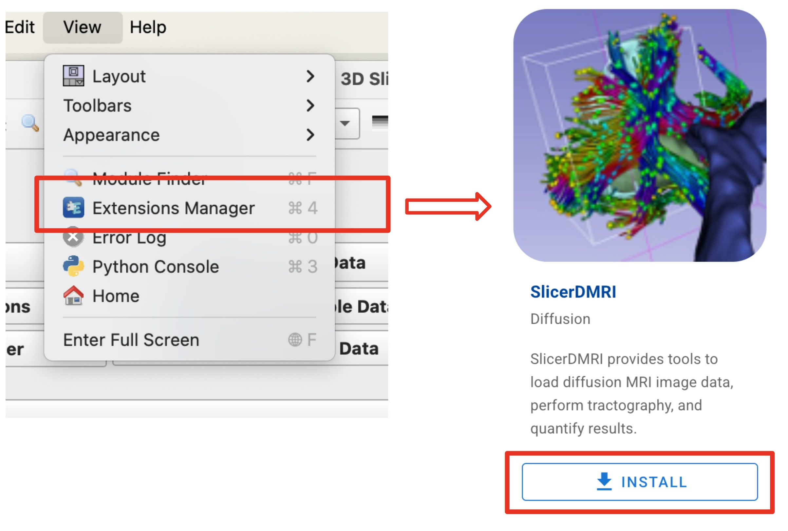

SlicerDMRI is a [3D Slicer](https://www.slicer.org/) extension.

First, [download and install 3D Slicer](https://download.slicer.org/) for your platform (Mac, Windows, or Linux).

Then, install the SlicerDMRI extension using the 3D Slicer Extensions Manager. *Please make sure to restart Slicer after installing the extension!* 

The source code for Slicer and SlicerDMRI is available from GitHub:

  - [https://github.com/SlicerDMRI/SlicerDMRI](https://github.com/SlicerDMRI/SlicerDMRI)
  - [https://github.com/Slicer/Slicer](https://github.com/Slicer/Slicer)

Full documentation for the Extensions Manager is available [here](https://slicer.readthedocs.io/en/latest/user_guide/extensions_manager.html).

For any questions, please contact us on the [Slicer Discussion Forum](https://discourse.slicer.org/c/community/slicerdmri), or file an issue on GitHub.
